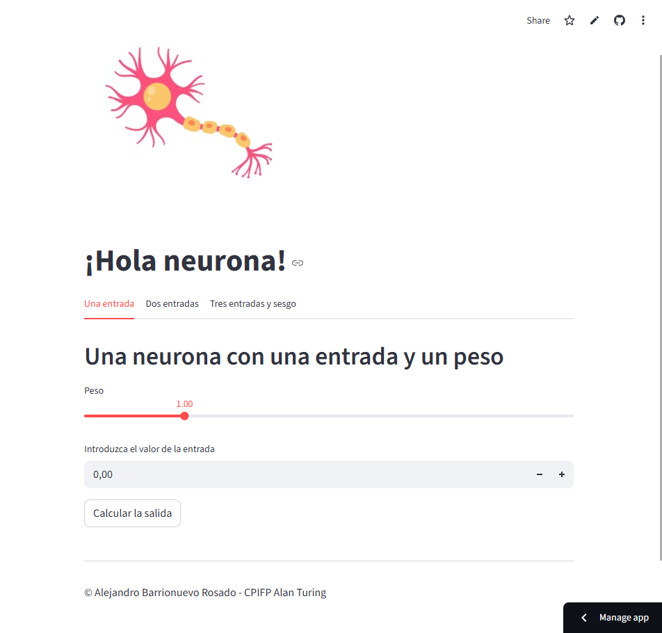
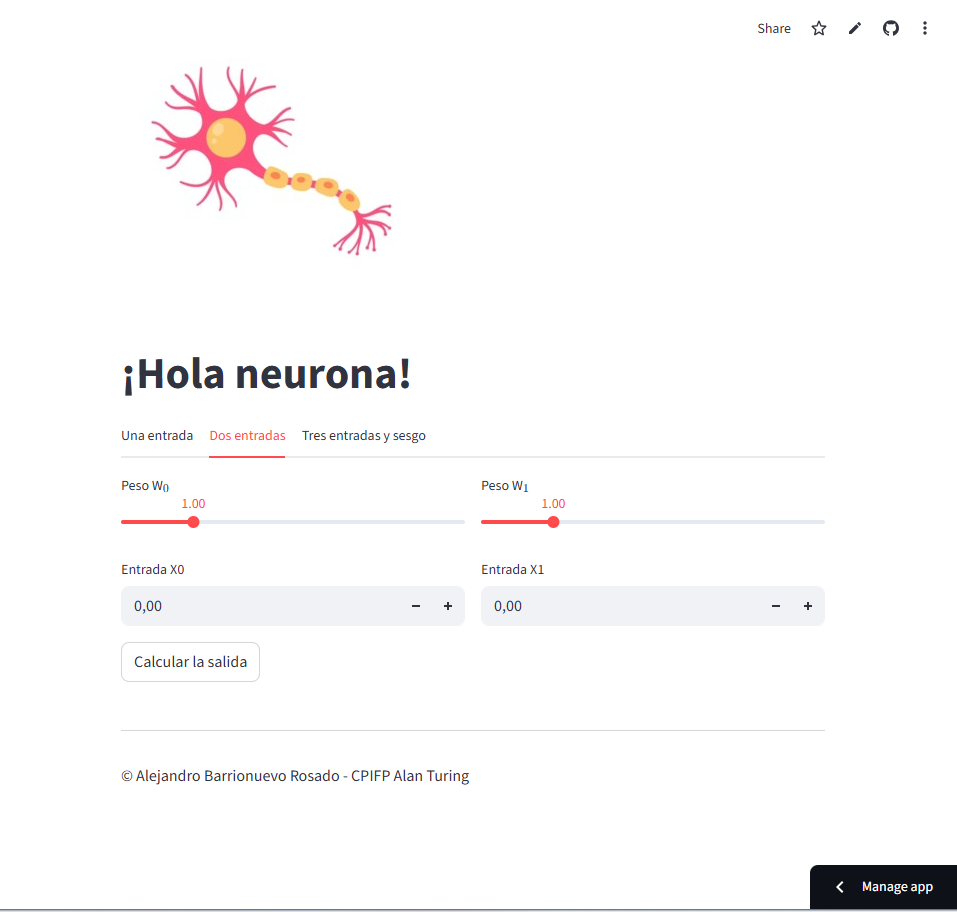
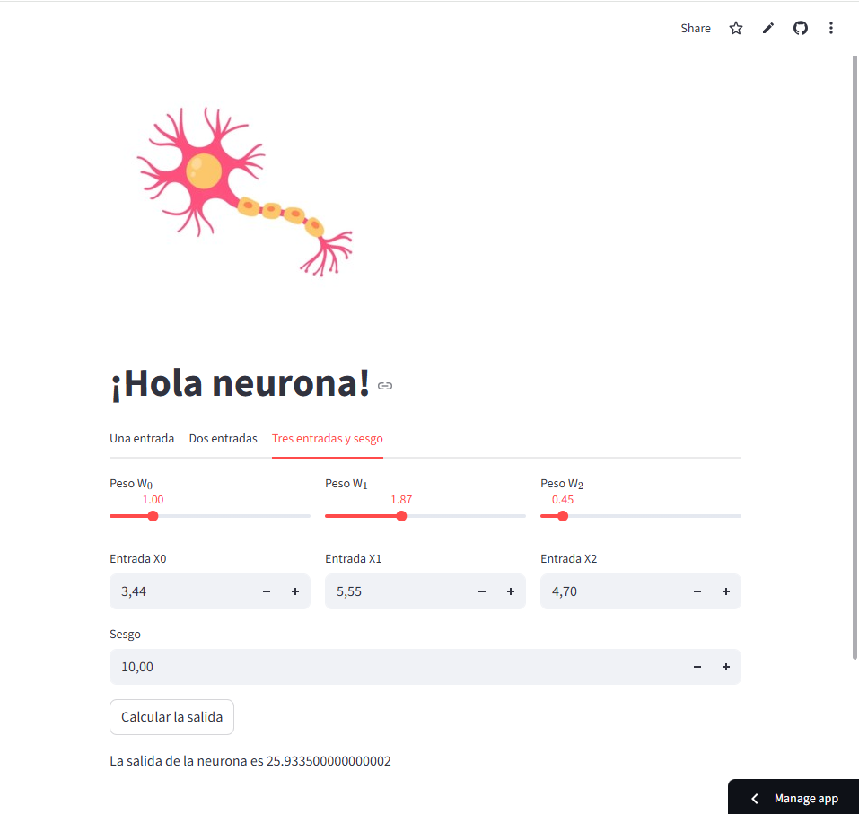

# 🧠 Neurona - Streamlit App

Aplicación desarrollada con **Streamlit** que permite visualizar y comprender el funcionamiento básico de una neurona artificial mediante entradas, pesos y sesgo.

🔗 **App en línea:**
[https://alejandrobr-neurona-app.streamlit.app/](https://alejandrobr-neurona-app.streamlit.app/)

## 🐳 Ejecutar con Docker

### 1. Construir y levantar el contenedor

```bash
docker-compose up --build
```

### 2. Abrir en el navegador

```
http://localhost:8501
```

## 📸 Ejemplos






## 🧩 Funcionalidades

La app se organiza en tres pestañas:

### 1️⃣ Una entrada

* Una entrada `x`
* Un peso `w`
* Salida:
  $$
  y = x \cdot w
  $$

### 2️⃣ Dos entradas

* Entradas: `x₀`, `x₁`
* Pesos: `w₀`, `w₁`
* Salida:
  $$
  y = x₀ \cdot w₀ + x₁ \cdot w₁
  $$

### 3️⃣ Tres entradas y sesgo

* Entradas: `x₀`, `x₁`, `x₂`
* Pesos: `w₀`, `w₁`, `w₂`
* Sesgo: `b`
* Salida:
  $$
  y = x₀ \cdot w₀ + x₁ \cdot w₁ + x₂ \cdot w₂ + b
    $$

## 📂 Estructura del proyecto

```
.
├── img/
│   ├── example_1.png
│   ├── example_2.png
│   ├── example_3.png
│   └── neuron.jpg
├── notebooks/
│   ├── ejercicio_01_mi_primera_neurona.ipynb
│   ├── ejercicio_02_una_neurona_con_dos_entradas.ipynb
│   └── ejercicio_03_una_neurona_con_tres_entradas_y_sesgo.ipynb
├── .gitignore
├── docker-compose.yml
├── Dockerfile
├── README.md
├── requirements.txt
└── streamlit_app.py
```


## ✍️ Créditos

**Alejandro Barrionuevo Rosado**

Máster de FP en Inteligencia Artificial y Big Data - CPIFP Alan Turing


